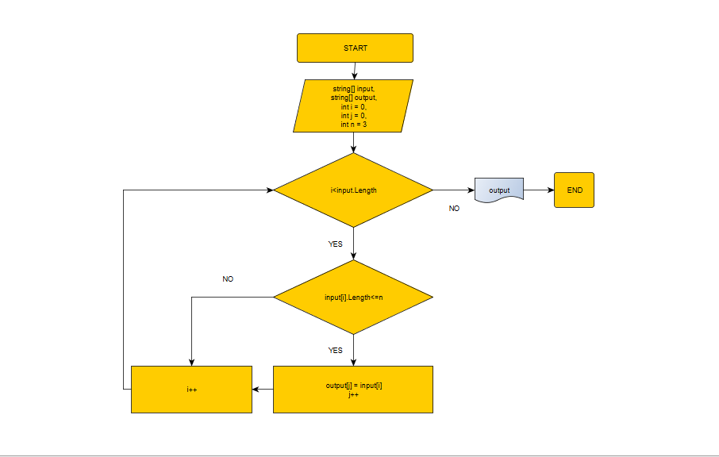

# Итоговая контрольная работа 1-ой четверти.

## Содержание 

1. [Задание](#задание)
2. [Решение](#алгоритм-решения)
3. [Диаграмма](#диаграмма)
4. [Результат](#пример-работы-программы)

## Задание:
1. Создать репозиторий на GitHub
2. Нарисовать блок-схему алгоритма (можно обойтись блок-схемой основной содержательной части,
если вы выделяете её в отдельный метод).
3. Снабдить репозиторий оформленным текстовым описанием решения (файл README.md).
4. Написать программу, решающую поставленную задачу.
5. Использовать контроль версий в работе над этим небольшим проектом (не должно быть так,
что всё залито одним коммитом, как минимум этапы 2, 3, и 4 должны быть расположены в разных коммитах).

### Задача:
Написать программу, которая из имеющегося массива строк формирует новый массив из строк,
длина которых меньше, либо равна 3 символам. 
Первоначальный массив можно ввести с клавиатуры, либо задать на старте выполнения алгоритма.
При решении не рекомендуется пользоваться коллекциями, лучше обойтись исключительно массивами.
### Примеры:
[“Hello”, “2”, “world”, “:-)”] ? [“2”, “:-)”]
[“1234”, “1567”, “-2”, “computer science”] ? [“-2”]
[“Russia”, “Denmark”, “Kazan”] ? []

## Алгоритм решения :

*  Выполняется проверка значений данных массива.
*  Проверяется соответсвие условию : Длинна значения меньше или равно 3 элементам.
*  Если условие верно значение передается в новый массив .
*  Дальше цикл пока условие верно проводится проверка до тех пор пока не кончится исходный массив.
*  После завершения цикла выводим новый заполненный массив.

## Диаграмма :

## Пример работы программы :

Введите значения через пробел:
212 4567 123 33 600 jig jigulevsk

Пример вывода программы: 

[2212, 4567, 123, 33, 600, jig, jigulevsk] -> [212, 123, 33, 600, jig]